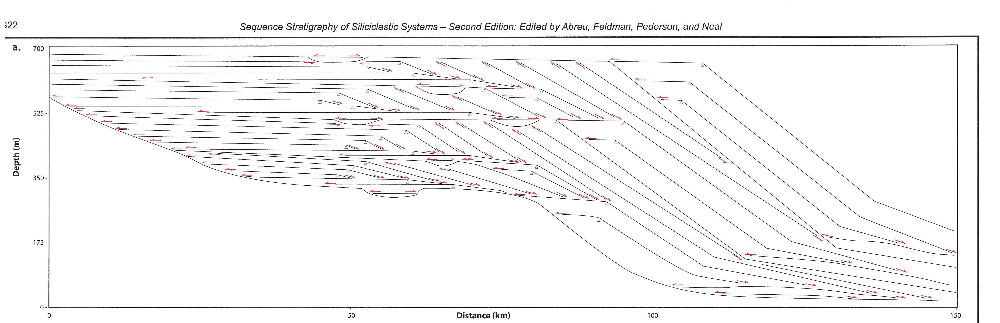

# COWORK PROMPT: Sequence Stratigraphy Online Exam

## Project Overview

Build an **interactive online exam** for a university-level Sequence Stratigraphy course (Seismo- und Sequenzstratigraphie, FAU Erlangen-Nürnberg). The exam tests students' ability to interpret clinoform cross-sections, identify sequence stratigraphic surfaces, construct Wheeler diagrams, and explain basin evolution.

**Exam Date**: 02.02.2026  
**Duration**: 2 hours (proctored, timed)  
**Platform**: Browser-based HTML/CSS/JavaScript (no external dependencies)  
**Target**: Desktop browsers (Chrome, Firefox, Edge, Safari)

---

## CRITICAL REQUIREMENTS

### Technical Constraints
- **NO external libraries** except standard browser APIs
- **Pure HTML5 Canvas** for drawing functionality
- **Vanilla JavaScript only** - no React, Vue, jQuery, etc.
- **Auto-save every 30 seconds** using localStorage
- **Export capability** to JSON and PNG for grading
- **2-hour countdown timer** with warnings at 30, 15, and 5 minutes remaining
- **Responsive design** for various desktop screen sizes (minimum 1280x720)
- **Browser compatibility**: Must work without WebGL or advanced features

### Stability Requirements
- All drawing operations must be undoable (Ctrl+Z or undo button)
- Canvas state must persist across browser refresh
- No memory leaks from canvas operations
- Graceful degradation if localStorage is unavailable

---

## EXAM STRUCTURE

### Section 1: Wheeler Diagram Construction (50 points)

#### 1.1 Upper Panel: Cross-Section Interpretation
Display the provided clinoform cross-section image (see attached `wheeler_exam_crosssection.png`).

**Image specifications:**
- Dimensions: 4750 x 1535 pixels (original)
- Display size: Scale to fit 90% of viewport width, maintaining aspect ratio
- Maximum display width: 1400px
- Axes: Distance (0-150 km) on X-axis, Depth (0-700 m) on Y-axis

**Student tasks on this panel:**
1. Identify and trace **Sequence Boundaries (SB)** - RED lines
2. Identify and trace **Maximum Flooding Surfaces (MFS)** - BLUE lines
3. Identify and trace **Transgressive Surfaces (TS)** - CYAN lines
4. Mark **clinoform rollover positions** with orange triangles (▼)

#### 1.2 Lower Panel: Wheeler Diagram Construction
Below the cross-section, provide an empty Wheeler diagram grid.

**Wheeler diagram specifications:**
- Y-axis: Relative Time (arbitrary units 1-50, or use "Time" with tick marks)
- X-axis: Distance (0-150 km, matching the cross-section)
- Grid: Light gray gridlines every 10 km horizontal, every 5 time units vertical
- Background: White
- Border: Black 1px solid

**Student tasks on this panel:**
1. Project identified surfaces from the cross-section onto the time-distance diagram
2. Draw **depositional intervals** as colored polygons:
   - **Highstand Systems Tract (HST)**: Cream/Yellow (#F5F5DC or #FFFACD) - APD stacking
   - **Transgressive Systems Tract (TST)**: Green (#90EE90 or #98FB98) - Retrogradational/PA stacking
   - **Lowstand Systems Tract (LST)**: Orange (#FFA500 or #FFB347) - Progradational/R stacking
3. Identify and mark **hiatus/lacuna** areas (leave white or use hatching)
4. Label system tracts using text tool

### Section 2: Interpretation Questions (50 points)

Three open-ended text questions requiring written responses.

**Question 1 (15 points): Geological Evolution**
```
Describe the geological evolution of this basin based on your Wheeler diagram interpretation. 
Include:
- The sequence of depositional events
- Major transgressive-regressive cycles
- Timing relationships between different parts of the basin
```

**Question 2 (20 points): Accommodation and Sediment Supply**
```
Analyze the changes in accommodation/sediment supply (A/S) ratio throughout the stratigraphic record:
- Where do you observe A/S > 1? What is the evidence?
- Where do you observe A/S < 1? What is the evidence?
- How do these changes relate to the shoreline trajectories you identified?
```

**Question 3 (15 points): Sequence Stratigraphic Surfaces**
```
Explain the genetic significance of the key surfaces you identified:
- What conditions create a Sequence Boundary vs. a Maximum Flooding Surface?
- Why is the distinction between MFS and SB critical for chronostratigraphic correlation?
- How would you use these surfaces for hydrocarbon exploration predictions?
```

---

## USER INTERFACE SPECIFICATIONS

### Layout Structure

```
+----------------------------------------------------------+
|  HEADER: Exam Title | Timer (02:00:00) | Save Status     |
+----------------------------------------------------------+
|                                                          |
|  SECTION 1: Wheeler Diagram Construction                 |
|                                                          |
|  +----------------------------------------------------+  |
|  |  TOOLBAR: [Line][Polygon][Text][Color][Undo][Clear]|  |
|  +----------------------------------------------------+  |
|  |                                                    |  |
|  |  CROSS-SECTION IMAGE (with drawing canvas overlay) |  |
|  |  [Interactive - students draw surfaces here]       |  |
|  |                                                    |  |
|  +----------------------------------------------------+  |
|  |                                                    |  |
|  |  WHEELER DIAGRAM GRID (with drawing canvas)        |  |
|  |  [Interactive - students construct diagram here]   |  |
|  |                                                    |  |
|  +----------------------------------------------------+  |
|                                                          |
|  SECTION 2: Interpretation Questions                     |
|                                                          |
|  Question 1: [Text Area - 300 words max]                |
|  Question 2: [Text Area - 400 words max]                |
|  Question 3: [Text Area - 300 words max]                |
|                                                          |
+----------------------------------------------------------+
|  FOOTER: [Export for Grading] [Submit Exam]             |
+----------------------------------------------------------+
```

### Toolbar Specifications

| Tool | Icon | Function | Keyboard Shortcut |
|------|------|----------|-------------------|
| Line/Polyline | 📏 | Draw sequence surfaces | L |
| Polygon Fill | ⬡ | Fill system tract areas | P |
| Text Label | T | Add text annotations | T |
| Color Picker | 🎨 | Select drawing color | C |
| Marker (Triangle) | ▼ | Place clinoform rollover markers | M |
| Eraser | 🧹 | Remove specific elements | E |
| Undo | ↩️ | Undo last action | Ctrl+Z |
| Redo | ↪️ | Redo undone action | Ctrl+Y |
| Clear Panel | 🗑️ | Clear current panel (with confirmation) | - |

### Color Palette (Pre-defined)

```javascript
const COLORS = {
  // Surfaces
  SB: '#FF0000',      // Sequence Boundary - Red
  MFS: '#0000FF',     // Maximum Flooding Surface - Blue  
  TS: '#00FFFF',      // Transgressive Surface - Cyan
  
  // System Tracts
  HST: '#FFFACD',     // Highstand - Cream/Light Yellow
  TST: '#98FB98',     // Transgressive - Pale Green
  LST: '#FFB347',     // Lowstand - Orange
  FSST: '#FF6B6B',    // Falling Stage - Light Red (if needed)
  
  // Markers
  ROLLOVER: '#FFA500', // Clinoform rollover - Orange
  
  // Other
  HIATUS: '#FFFFFF',   // Non-deposition - White (or hatched)
  GRID: '#CCCCCC',     // Grid lines - Light Gray
  AXIS: '#000000'      // Axis lines - Black
};
```

### Timer Implementation

```javascript
// Timer specifications
const EXAM_DURATION_MS = 2 * 60 * 60 * 1000; // 2 hours
const WARNING_TIMES = [30, 15, 5]; // minutes remaining

// Timer display format: HH:MM:SS
// Color changes:
// - Green: > 30 minutes remaining
// - Yellow: 30-15 minutes remaining
// - Orange: 15-5 minutes remaining
// - Red (flashing): < 5 minutes remaining

// Auto-submit when timer reaches 0
```

### Auto-Save Implementation

```javascript
// Auto-save every 30 seconds
const AUTOSAVE_INTERVAL_MS = 30000;

// Save to localStorage:
const examState = {
  timestamp: Date.now(),
  crossSectionCanvas: canvasToDataURL(crossSectionCanvas),
  wheelerCanvas: canvasToDataURL(wheelerCanvas),
  drawingHistory: [...drawingHistory], // For undo/redo
  answers: {
    question1: document.getElementById('q1').value,
    question2: document.getElementById('q2').value,
    question3: document.getElementById('q3').value
  },
  timeRemaining: remainingTime
};

localStorage.setItem('sequenceStratExam', JSON.stringify(examState));

// Visual indicator: "Last saved: HH:MM:SS"
```

---

## CANVAS DRAWING IMPLEMENTATION

### Cross-Section Canvas

```javascript
// Layer structure:
// 1. Background layer: The cross-section image (static)
// 2. Drawing layer: Student annotations (interactive)

// Drawing modes:
// - 'line': Click to start, click to add points, double-click to finish
// - 'polygon': Click to define vertices, close by clicking near start
// - 'marker': Single click to place triangle marker
// - 'text': Click to position, type to add label
// - 'eraser': Click on element to select and delete

// Line drawing specifications:
// - Line width: 3px for surfaces
// - Anti-aliased rendering
// - Snap to endpoints of existing lines (within 10px)
```

### Wheeler Diagram Canvas

```javascript
// Pre-drawn elements (non-editable):
// - X-axis with labels (0, 50, 100, 150 km)
// - Y-axis with labels (Time units or generic scale)
// - Grid lines (light gray, dashed)

// Student drawing area:
// - Polygon tool for filling depositional intervals
// - Line tool for surface projections
// - Text tool for labeling system tracts

// Coordinate system:
// - Origin at bottom-left of diagram area
// - X increases rightward (distance)
// - Y increases upward (time)
```

### Drawing History (Undo/Redo Stack)

```javascript
const drawingHistory = {
  crossSection: [],
  wheeler: [],
  maxHistory: 50 // Limit to prevent memory issues
};

// Each action stored as:
{
  type: 'line' | 'polygon' | 'marker' | 'text' | 'erase',
  canvas: 'crossSection' | 'wheeler',
  data: { /* tool-specific data */ },
  timestamp: Date.now()
}
```

---

## EXPORT FUNCTIONALITY

### Export for Grading (JSON + Images)

```javascript
function exportExam() {
  const exportData = {
    metadata: {
      studentId: studentId, // If available from login
      examDate: new Date().toISOString(),
      timeSpent: EXAM_DURATION_MS - remainingTime,
      browserInfo: navigator.userAgent
    },
    
    drawings: {
      crossSection: {
        image: crossSectionCanvas.toDataURL('image/png'),
        elements: crossSectionDrawingData // Array of all drawn elements
      },
      wheeler: {
        image: wheelerCanvas.toDataURL('image/png'),
        elements: wheelerDrawingData
      }
    },
    
    answers: {
      question1: {
        text: document.getElementById('q1').value,
        wordCount: countWords(document.getElementById('q1').value)
      },
      question2: {
        text: document.getElementById('q2').value,
        wordCount: countWords(document.getElementById('q2').value)
      },
      question3: {
        text: document.getElementById('q3').value,
        wordCount: countWords(document.getElementById('q3').value)
      }
    }
  };
  
  // Download as JSON
  downloadJSON(exportData, `exam_${studentId}_${Date.now()}.json`);
  
  // Also download canvas images separately for easy viewing
  downloadImage(crossSectionCanvas, `crosssection_${studentId}.png`);
  downloadImage(wheelerCanvas, `wheeler_${studentId}.png`);
}
```

---

## FILE STRUCTURE

```
sequence-strat-exam/
├── index.html              # Main exam page
├── css/
│   └── exam.css           # All styles
├── js/
│   ├── main.js            # Application entry point
│   ├── timer.js           # Timer functionality
│   ├── canvas.js          # Canvas drawing tools
│   ├── storage.js         # LocalStorage handling
│   └── export.js          # Export functionality
├── images/
│   └── wheeler_exam_crosssection.png  # The exam image
└── README.md              # Instructions for deployment
```

---

## DETAILED HTML STRUCTURE

```html
<!DOCTYPE html>
<html lang="en">
<head>
    <meta charset="UTF-8">
    <meta name="viewport" content="width=device-width, initial-scale=1.0">
    <title>Sequence Stratigraphy Exam - FAU WS 2025/26</title>
    <link rel="stylesheet" href="css/exam.css">
</head>
<body>
    <!-- Header -->
    <header class="exam-header">
        <h1>Sequence Stratigraphy Examination</h1>
        <div class="header-info">
            <span class="course-code">AS-F1 / GT-F1</span>
            <span class="timer" id="timer">02:00:00</span>
            <span class="save-status" id="saveStatus">Not saved</span>
        </div>
    </header>

    <!-- Main Content -->
    <main class="exam-content">
        <!-- Section 1: Wheeler Diagram -->
        <section class="exam-section" id="section1">
            <h2>Section 1: Wheeler Diagram Construction (50 points)</h2>
            
            <!-- Instructions -->
            <div class="instructions">
                <p><strong>Task:</strong> Interpret the clinoform cross-section below. 
                Identify sequence stratigraphic surfaces, then construct the corresponding 
                Wheeler (chronostratigraphic) diagram.</p>
                
                <div class="legend">
                    <h4>Color Conventions:</h4>
                    <ul>
                        <li><span class="color-box sb"></span> Sequence Boundary (SB) - Red</li>
                        <li><span class="color-box mfs"></span> Maximum Flooding Surface (MFS) - Blue</li>
                        <li><span class="color-box ts"></span> Transgressive Surface (TS) - Cyan</li>
                        <li><span class="color-box hst"></span> Highstand Systems Tract (HST) - Cream</li>
                        <li><span class="color-box tst"></span> Transgressive Systems Tract (TST) - Green</li>
                        <li><span class="color-box lst"></span> Lowstand Systems Tract (LST) - Orange</li>
                    </ul>
                </div>
            </div>

            <!-- Toolbar -->
            <div class="toolbar" id="toolbar">
                <button class="tool-btn active" data-tool="line" title="Draw Line (L)">
                    <span class="icon">📏</span> Line
                </button>
                <button class="tool-btn" data-tool="polygon" title="Fill Polygon (P)">
                    <span class="icon">⬡</span> Polygon
                </button>
                <button class="tool-btn" data-tool="marker" title="Place Marker (M)">
                    <span class="icon">▼</span> Marker
                </button>
                <button class="tool-btn" data-tool="text" title="Add Text (T)">
                    <span class="icon">T</span> Text
                </button>
                <div class="color-selector">
                    <label>Color:</label>
                    <select id="colorSelect">
                        <option value="#FF0000">SB (Red)</option>
                        <option value="#0000FF">MFS (Blue)</option>
                        <option value="#00FFFF">TS (Cyan)</option>
                        <option value="#FFFACD">HST (Cream)</option>
                        <option value="#98FB98">TST (Green)</option>
                        <option value="#FFB347">LST (Orange)</option>
                        <option value="#FFA500">Rollover (Orange)</option>
                    </select>
                </div>
                <button class="tool-btn" id="undoBtn" title="Undo (Ctrl+Z)">
                    <span class="icon">↩️</span> Undo
                </button>
                <button class="tool-btn" id="redoBtn" title="Redo (Ctrl+Y)">
                    <span class="icon">↪️</span> Redo
                </button>
                <button class="tool-btn danger" id="clearBtn" title="Clear All">
                    <span class="icon">🗑️</span> Clear
                </button>
            </div>

            <!-- Cross-Section Canvas -->
            <div class="canvas-container" id="crossSectionContainer">
                <h3>Cross-Section (Stratal Terminations)</h3>
                <div class="canvas-wrapper">
                    
                    <canvas id="crossSectionCanvas" class="drawing-canvas"></canvas>
                </div>
            </div>

            <!-- Wheeler Diagram Canvas -->
            <div class="canvas-container" id="wheelerContainer">
                <h3>Wheeler Diagram (Chronostratigraphic Chart)</h3>
                <div class="canvas-wrapper">
                    <canvas id="wheelerCanvas" class="drawing-canvas"></canvas>
                </div>
            </div>
        </section>

        <!-- Section 2: Questions -->
        <section class="exam-section" id="section2">
            <h2>Section 2: Interpretation Questions (50 points)</h2>

            <div class="question" id="question1">
                <h3>Question 1: Geological Evolution (15 points)</h3>
                <p>Describe the geological evolution of this basin based on your 
                Wheeler diagram interpretation. Include the sequence of depositional 
                events, major transgressive-regressive cycles, and timing relationships 
                between different parts of the basin.</p>
                <textarea id="q1" maxlength="2000" placeholder="Enter your answer here..."></textarea>
                <span class="word-count" id="q1Count">0/300 words</span>
            </div>

            <div class="question" id="question2">
                <h3>Question 2: Accommodation and Sediment Supply (20 points)</h3>
                <p>Analyze the changes in accommodation/sediment supply (A/S) ratio 
                throughout the stratigraphic record. Where do you observe A/S > 1 
                and A/S < 1? What is the evidence? How do these changes relate to 
                the shoreline trajectories you identified?</p>
                <textarea id="q2" maxlength="3000" placeholder="Enter your answer here..."></textarea>
                <span class="word-count" id="q2Count">0/400 words</span>
            </div>

            <div class="question" id="question3">
                <h3>Question 3: Sequence Stratigraphic Surfaces (15 points)</h3>
                <p>Explain the genetic significance of the key surfaces you identified. 
                What conditions create a Sequence Boundary vs. a Maximum Flooding Surface? 
                Why is this distinction critical for chronostratigraphic correlation? 
                How would you use these surfaces for hydrocarbon exploration?</p>
                <textarea id="q3" maxlength="2000" placeholder="Enter your answer here..."></textarea>
                <span class="word-count" id="q3Count">0/300 words</span>
            </div>
        </section>
    </main>

    <!-- Footer -->
    <footer class="exam-footer">
        <button class="btn-secondary" id="exportBtn">Export for Review</button>
        <button class="btn-primary" id="submitBtn">Submit Exam</button>
    </footer>

    <!-- Confirmation Modal -->
    <div class="modal" id="submitModal">
        <div class="modal-content">
            <h3>Submit Exam?</h3>
            <p>Are you sure you want to submit your exam? This action cannot be undone.</p>
            <div class="modal-actions">
                <button class="btn-secondary" id="cancelSubmit">Cancel</button>
                <button class="btn-primary" id="confirmSubmit">Submit</button>
            </div>
        </div>
    </div>

    <!-- Scripts -->
    <script src="js/timer.js"></script>
    <script src="js/canvas.js"></script>
    <script src="js/storage.js"></script>
    <script src="js/export.js"></script>
    <script src="js/main.js"></script>
</body>
</html>
```

---

## CSS SPECIFICATIONS

```css
/* Key styling requirements */

:root {
    --primary-color: #1a5276;
    --secondary-color: #2980b9;
    --success-color: #27ae60;
    --warning-color: #f39c12;
    --danger-color: #e74c3c;
    --light-bg: #f8f9fa;
    --border-color: #dee2e6;
}

/* Timer colors based on remaining time */
.timer.safe { color: var(--success-color); }
.timer.warning { color: var(--warning-color); }
.timer.danger { color: var(--danger-color); animation: pulse 1s infinite; }

@keyframes pulse {
    0%, 100% { opacity: 1; }
    50% { opacity: 0.5; }
}

/* Canvas layering */
.canvas-wrapper {
    position: relative;
    display: inline-block;
}

.background-image {
    display: block;
    max-width: 100%;
    height: auto;
}

.drawing-canvas {
    position: absolute;
    top: 0;
    left: 0;
    cursor: crosshair;
}

/* Toolbar styling */
.toolbar {
    display: flex;
    gap: 10px;
    padding: 10px;
    background: var(--light-bg);
    border: 1px solid var(--border-color);
    border-radius: 4px;
    margin-bottom: 15px;
}

.tool-btn.active {
    background: var(--primary-color);
    color: white;
}

/* Legend color boxes */
.color-box {
    display: inline-block;
    width: 20px;
    height: 12px;
    border: 1px solid #000;
    margin-right: 5px;
    vertical-align: middle;
}

.color-box.sb { background: #FF0000; }
.color-box.mfs { background: #0000FF; }
.color-box.ts { background: #00FFFF; }
.color-box.hst { background: #FFFACD; }
.color-box.tst { background: #98FB98; }
.color-box.lst { background: #FFB347; }
```

---

## JAVASCRIPT CORE FUNCTIONALITY

### Canvas Drawing Module (canvas.js)

```javascript
class DrawingCanvas {
    constructor(canvasId, backgroundImage = null) {
        this.canvas = document.getElementById(canvasId);
        this.ctx = this.canvas.getContext('2d');
        this.backgroundImage = backgroundImage;
        this.isDrawing = false;
        this.currentTool = 'line';
        this.currentColor = '#FF0000';
        this.lineWidth = 3;
        this.points = [];
        this.elements = [];
        this.undoStack = [];
        this.redoStack = [];
        
        this.init();
    }
    
    init() {
        // Set canvas size to match container or image
        this.resizeCanvas();
        
        // Event listeners
        this.canvas.addEventListener('mousedown', this.handleMouseDown.bind(this));
        this.canvas.addEventListener('mousemove', this.handleMouseMove.bind(this));
        this.canvas.addEventListener('mouseup', this.handleMouseUp.bind(this));
        this.canvas.addEventListener('dblclick', this.handleDoubleClick.bind(this));
        
        // Keyboard shortcuts
        document.addEventListener('keydown', this.handleKeyDown.bind(this));
        
        // Draw initial state
        this.redraw();
    }
    
    resizeCanvas() {
        if (this.backgroundImage) {
            const img = document.getElementById(this.backgroundImage);
            this.canvas.width = img.clientWidth;
            this.canvas.height = img.clientHeight;
        }
    }
    
    handleMouseDown(e) {
        const pos = this.getMousePos(e);
        
        switch(this.currentTool) {
            case 'line':
                this.startLine(pos);
                break;
            case 'polygon':
                this.addPolygonPoint(pos);
                break;
            case 'marker':
                this.placeMarker(pos);
                break;
            case 'text':
                this.startText(pos);
                break;
        }
    }
    
    // ... (additional methods for each tool)
    
    undo() {
        if (this.elements.length > 0) {
            const element = this.elements.pop();
            this.undoStack.push(element);
            this.redraw();
        }
    }
    
    redo() {
        if (this.undoStack.length > 0) {
            const element = this.undoStack.pop();
            this.elements.push(element);
            this.redraw();
        }
    }
    
    redraw() {
        this.ctx.clearRect(0, 0, this.canvas.width, this.canvas.height);
        
        // Draw all saved elements
        this.elements.forEach(element => {
            this.drawElement(element);
        });
        
        // Draw current in-progress element
        if (this.points.length > 0) {
            this.drawPreview();
        }
    }
    
    toDataURL() {
        return this.canvas.toDataURL('image/png');
    }
    
    getState() {
        return {
            elements: [...this.elements],
            dataURL: this.toDataURL()
        };
    }
    
    loadState(state) {
        this.elements = state.elements || [];
        this.redraw();
    }
}
```

### Timer Module (timer.js)

```javascript
class ExamTimer {
    constructor(durationMs, onTick, onWarning, onExpire) {
        this.duration = durationMs;
        this.remaining = durationMs;
        this.onTick = onTick;
        this.onWarning = onWarning;
        this.onExpire = onExpire;
        this.warningTimes = [30 * 60 * 1000, 15 * 60 * 1000, 5 * 60 * 1000];
        this.warningsShown = new Set();
        this.intervalId = null;
    }
    
    start() {
        this.intervalId = setInterval(() => {
            this.remaining -= 1000;
            this.onTick(this.remaining);
            
            // Check for warnings
            this.warningTimes.forEach(time => {
                if (this.remaining <= time && !this.warningsShown.has(time)) {
                    this.warningsShown.add(time);
                    this.onWarning(Math.floor(time / 60000));
                }
            });
            
            // Check for expiry
            if (this.remaining <= 0) {
                this.stop();
                this.onExpire();
            }
        }, 1000);
    }
    
    stop() {
        if (this.intervalId) {
            clearInterval(this.intervalId);
            this.intervalId = null;
        }
    }
    
    formatTime(ms) {
        const hours = Math.floor(ms / 3600000);
        const minutes = Math.floor((ms % 3600000) / 60000);
        const seconds = Math.floor((ms % 60000) / 1000);
        return `${hours.toString().padStart(2, '0')}:${minutes.toString().padStart(2, '0')}:${seconds.toString().padStart(2, '0')}`;
    }
    
    getRemaining() {
        return this.remaining;
    }
    
    setRemaining(ms) {
        this.remaining = ms;
    }
}
```

### Storage Module (storage.js)

```javascript
const ExamStorage = {
    KEY: 'sequenceStratExam',
    
    save(state) {
        try {
            const data = {
                timestamp: Date.now(),
                ...state
            };
            localStorage.setItem(this.KEY, JSON.stringify(data));
            return true;
        } catch (e) {
            console.error('Failed to save exam state:', e);
            return false;
        }
    },
    
    load() {
        try {
            const data = localStorage.getItem(this.KEY);
            return data ? JSON.parse(data) : null;
        } catch (e) {
            console.error('Failed to load exam state:', e);
            return null;
        }
    },
    
    clear() {
        localStorage.removeItem(this.KEY);
    },
    
    exists() {
        return localStorage.getItem(this.KEY) !== null;
    }
};
```

---

## GRADING EXPORT FORMAT

The export function should generate a ZIP file or multiple downloads containing:

1. **exam_submission.json** - Complete exam data:
```json
{
    "metadata": {
        "examVersion": "1.0",
        "courseCode": "AS-F1/GT-F1",
        "examDate": "2026-02-02",
        "submissionTime": "2026-02-02T16:30:00Z",
        "totalTimeSpent": 6847000,
        "browserInfo": "Mozilla/5.0..."
    },
    "section1": {
        "crossSection": {
            "elements": [
                {"type": "line", "color": "#FF0000", "points": [[x1,y1], [x2,y2], ...], "label": "SB1"},
                {"type": "polygon", "color": "#98FB98", "points": [...], "label": "TST"},
                ...
            ]
        },
        "wheeler": {
            "elements": [...]
        }
    },
    "section2": {
        "question1": {"text": "...", "wordCount": 287},
        "question2": {"text": "...", "wordCount": 356},
        "question3": {"text": "...", "wordCount": 245}
    }
}
```

2. **crosssection_annotated.png** - The cross-section with student annotations
3. **wheeler_diagram.png** - The completed Wheeler diagram

---

## TESTING CHECKLIST

Before deployment, verify:

- [ ] Timer counts down correctly and shows warnings
- [ ] Auto-save triggers every 30 seconds
- [ ] Page refresh restores all drawing and text data
- [ ] Undo/redo work for all drawing tools
- [ ] All colors render correctly on both canvases
- [ ] Export generates valid JSON and PNG files
- [ ] Works on Chrome, Firefox, Edge, Safari
- [ ] Works at different screen resolutions (1280x720 minimum)
- [ ] Text areas enforce word limits
- [ ] Submit confirmation modal works
- [ ] Timer auto-submits at 0:00

---

## DEPLOYMENT NOTES

1. **Image hosting**: Ensure `wheeler_exam_crosssection.png` is served with proper CORS headers if loading from different domain
2. **HTTPS required**: LocalStorage may not work reliably on HTTP
3. **Disable browser caching** for exam files during exam period
4. **Backup mechanism**: Consider server-side saving as backup to localStorage

---

## ADDITIONAL FEATURES (OPTIONAL, IF TIME PERMITS)

1. **Snap-to-grid** for Wheeler diagram drawing
2. **Surface continuity hints** (visual guides showing where surfaces should connect)
3. **Zoom functionality** for the cross-section
4. **Dark mode** for reduced eye strain
5. **Accessibility features** (keyboard-only navigation, screen reader support)

---

## CONTACT FOR CLARIFICATION

If any specifications are unclear, prioritize:
1. **Stability** over features
2. **Simplicity** over sophistication
3. **Browser compatibility** over cutting-edge features

The exam must work reliably for all students on exam day. No experimental features.
